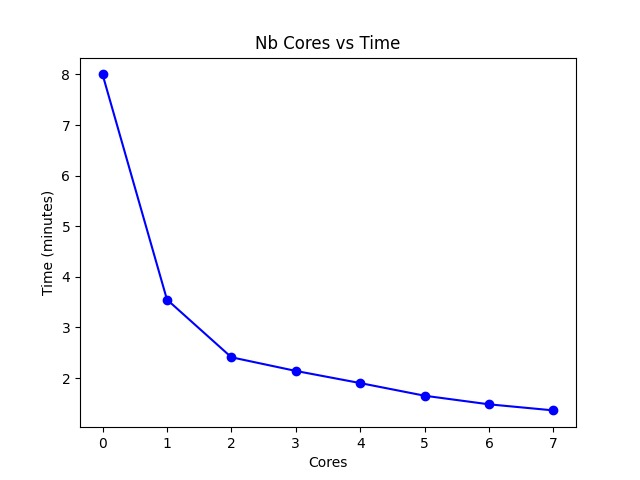
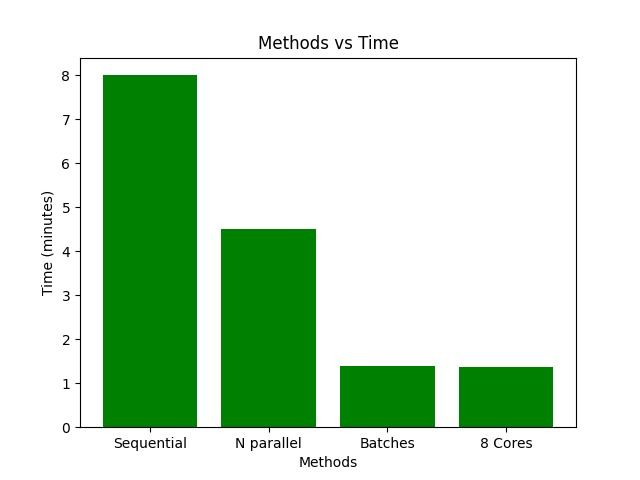

# Parallel File Compression Utility

## Overview
The Parallel File Compression utility is a modern application designed to leverage the capabilities of multi-core processors to enhance the performance of file compression tasks. By employing parallel computing concepts, this utility significantly improves the efficiency of compressing large data files. This project not only demonstrates the practical application of parallel computing but also serves as a benchmark to analyze the performance gains achieved through different parallelization strategies.

## Features
- **Sequential Compression**: Compresses files one at a time, serving as a baseline for performance comparison.
- **Basic Parallel Compression**: Compresses two files in parallel, introducing the concept of program-level parallelism.
- **Advanced Parallel Compression**:
  - **Full Parallelism**: Initiates N parallel tasks simultaneously, one for each of the N files.
  - **Batched Core Parallelism**: Processes files in batches, with each batch containing `NB_CORES` tasks, ensuring all CPU cores are utilized efficiently.
  - **Distributed Core Parallelism**: Distributes the compression tasks evenly across `B_CORES` tasks, allowing multiple file compressions per core.

## Getting Started
1. **Prerequisites**
   - Ensure you have a modern multi-core processor to take full advantage of the utility's capabilities.
   - The utility is designed to work optimally with files of at least 30MB in size to ensure that task runtimes are significant compared to the overhead of creating parallel tasks.

2. **Installation**
   - Clone the repository to your local machine.
   

3. **Running the Utility**
   - Use the command-line interface to specify the compression task.
   - Choose the parallelization strategy and the number of files to compress.
   - The utility will output the compressed files and a performance report.

## Performance Analysis
- Conduct a thorough performance analysis by comparing the time taken to compress files using sequential execution vs. parallel execution with 2, 3, 4, ..., `NB_CORES`.
- Utilize the provided excel template to input your results and generate graphs that illustrate the performance scale-up achieved with each parallelization strategy.
- Investigate and document the efficiency and scalability of each strategy, providing insights into the optimal use cases for each approach.

### Results and Analysis
The following results were obtained for each parallelization strategy:

- **Sequential**: 8 minutes
- **N Parallel**: 4.5 minutes
- **NB_CORES Batch**: 1.4 minutes
- **NB_CORES Equal**: 1.38 minutes
- **Fixed Number of Cores**:
  - 2 cores: 3.55 minutes
  - 3 cores: 2.41 minutes
  - 4 cores: 2.14 minutes
  - 5 cores: 1.9 minutes
  - 6 cores: 1.65 minutes
  - 7 cores: 1.48 minutes
  - 8 cores: 1.36 minutes

The analysis of these results shows that parallel processing significantly improves the efficiency of file compression compared to sequential processing. However, the benefit of adding more cores diminishes as the number of cores increases, which is a common characteristic of parallel computing. Both the batch processing and equal distribution strategies are effective in utilizing multiple cores, with no clear winner between the two in this case.

### Graphical Representation
The performance scale-up and the diminishing returns as the number of cores increases can be visually represented in graphs. Below are placeholders for the graphs obtained from the results:

- **Graph 1**: Performance improvement with an increasing number of cores
  - 
- **Graph 2**: Comparison of different parallelization strategies
  - 

### Conclusion
The Parallel File Compression utility showcases the significant performance enhancements that can be achieved through thoughtful application of parallel computing concepts. By analyzing the results, users can gain valuable insights into how different parallelization strategies can be effectively employed in real-world scenarios.

## Notes
- `NB_CORES` refers to the number of cores on your CPU.
- It is recommended to work with around 300 files (including duplicates) to have a substantial dataset for analysis.
- Ensure that your environment is correctly set up to support parallel processing to get accurate performance insights.

